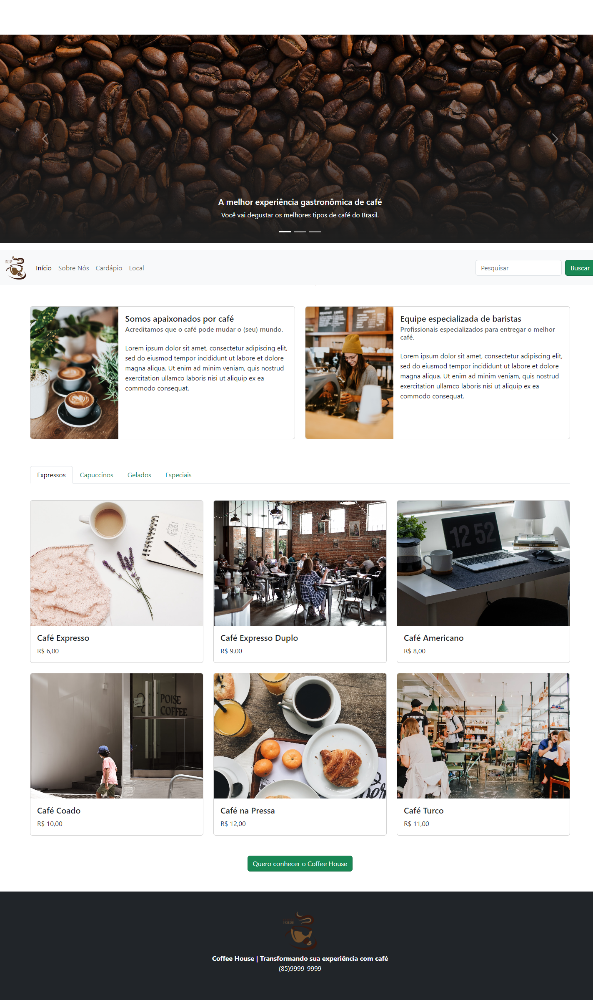

# Coffee Shop Website

This project is a responsive website for a coffee shop. It is built using HTML, CSS, and Bootstrap, and follows the mobile-first design concept.

## Description

The Responsive Coffee Shop Website project aims to provide a visually appealing and user-friendly online platform for a coffee shop to showcase its products and services. The website is designed to be responsive, ensuring that it looks great and works well on any device, including desktop computers, tablets, and smartphones.

## Features

- Visually appealing and user-friendly design
- Responsive layout for optimal viewing on any device
- Menu page with detailed information about the coffee shop's products

## Technologies Used

- HTML
- CSS
- Bootstrap

## Usage

To access the Responsive Coffee Shop Website, simply visit the website URL or clone this repository and open the `index.html` file in your preferred web browser. The website will load automatically, and you can start browsing the different pages and features.

## Contributing

Contributions to this project are welcome! Feel free to fork this repository and submit a pull request with your changes.

## Credits

This project was built by [Francisco Silva](https://github.com/Burntroll).

## License

This project is licensed under the [MIT License](https://opensource.org/licenses/MIT).

## Results

